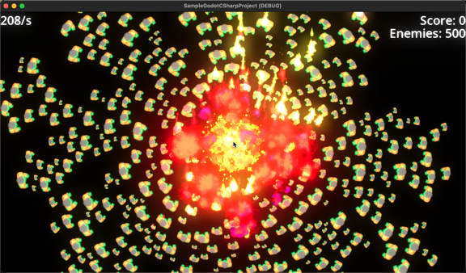

# SampleGodotCSharpProject

A work-in-progress example Godot 4 project written in C# (with .Net 6.0), making use of the awesome utilities and game concepts from [@firebelley](https://github.com/firebelley)

## How to build/run

Checkout **FireBelley's** awesome [Godot 4 Branch of GodotUtilities](https://github.com/firebelley/GodotUtilities/tree/godot-4) project and soft-link the `GodotUtilities/src` folder to `GodotUtilities` in the root of this project.

Make sure you are using latest **Godot 4** version (I build **Godot 4** from source nearly every day and will try to keep this repo up-to-date accordingly).

Look around, improve and feedback welcome.

## Screenshots

Splash screens generated by Stable Diffusion 😜.

## Versioning

Will eventually follow some form of semantic versioning.
